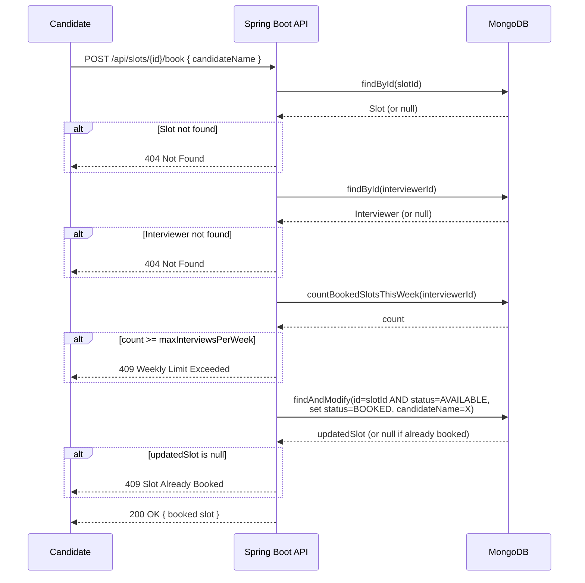

# Interview Scheduling System — Design Document

## Overview

An automated interview scheduling system built with **Java Spring Boot**, **MongoDB**, and **Next.js**. It allows interviewers to define their availability, auto-generate 1-hour interview slots, and let candidates book exactly one slot. Supports rescheduling and cancellation. Designed with race-condition safety and proper error handling throughout.

---

## Architecture

```
┌─────────────────────┐        HTTP/REST        ┌──────────────────────────┐
│   Next.js Frontend  │ ──────────────────────▶ │  Spring Boot Backend     │
│   (localhost:3000)  │ ◀────────────────────── │  (localhost:8080)        │
└─────────────────────┘                         └────────────┬─────────────┘
                                                             │ MongoDB Driver
                                                    ┌────────▼────────┐
                                                    │    MongoDB       │
                                                    │  interviewers    │
                                                    │  slots           │
                                                    └─────────────────┘
```

### Key Spring Boot Components
| Layer | Class | Responsibility |
|---|---|---|
| Controller | `SchedulingController` | REST endpoint definitions, request parsing |
| Service | `SchedulingService` | Business logic, atomic booking, slot generation |
| Repository | `InterviewerRepository` | CRUD for `interviewers` collection |
| Repository | `SlotRepository` | CRUD + range queries for `slots` collection |
| Exception | `GlobalExceptionHandler` | Centralized error-to-HTTP-status mapping |

---

## DB Schema

### Collection: `interviewers`
```json
{
  "_id": "ObjectId (MongoDB auto-generated)",
  "name": "String — interviewer full name",
  "email": "String — interviewer email",
  "maxInterviewsPerWeek": "int — maximum bookings allowed per calendar week",
  "availability": [
    {
      "startTime": "long — epoch milliseconds (window start)",
      "endTime": "long — epoch milliseconds (window end)"
    }
  ]
}
```

### Collection: `slots`
```json
{
  "_id": "ObjectId (MongoDB auto-generated)",
  "interviewerId": "String — reference to interviewers._id (indexed)",
  "startTime": "long — epoch milliseconds slot start (indexed)",
  "endTime": "long — epoch milliseconds slot end",
  "status": "Enum — AVAILABLE | BOOKED",
  "candidateName": "String | null — set when BOOKED",
  "version": "long — optimistic lock version (@Version)"
}
```

**Indexes:**
- `interviewerId` — for weekly booking count queries
- `startTime` — for range queries in `GET /api/slots`

---

## API Documentation

### 1. Create Interviewer
```
POST /api/v1/interviewers
```
**Request body:**
```json
{
  "name": "Alice Johnson",
  "email": "alice@company.com",
  "maxInterviewsPerWeek": 5
}
```
**Response 200:**
```json
{
  "id": "67b2c3d4e5f6a7b8c9d0e1f2",
  "name": "Alice Johnson",
  "email": "alice@company.com",
  "maxInterviewsPerWeek": 5,
  "availability": null
}
```

---

### 2. Set Availability & Generate Slots
```
POST /api/v1/interviewers/{id}/availability
```
**Request body** (array of availability windows in epoch milliseconds):
```json
[
  {
    "startTime": 1741593600000,
    "endTime":   1741608000000
  }
]
```
The backend **automatically slices** each window into 1-hour `Slot` documents and saves them.

**Response 200:** *(empty body)*

**Errors:**
| Status | Cause |
|---|---|
| 404 | Interviewer ID does not exist |

---

### 3. View Available Slots
```
GET /api/slots?start={epochMs}&end={epochMs}
```
Returns all slots (AVAILABLE + BOOKED) whose `startTime` falls in `[start, end]`.

**Response 200:**
```json
[
  {
    "id": "slot-abc123",
    "interviewerId": "67b2c3d4e5f6a7b8c9d0e1f2",
    "startTime": 1741593600000,
    "endTime":   1741597200000,
    "status": "AVAILABLE",
    "candidateName": null,
    "version": 0
  }
]
```

---

### 4. Book a Slot
```
POST /api/slots/{id}/book
```
**Request body:**
```json
{ "candidateName": "Bob Smith" }
```
**Response 200:**
```json
{
  "id": "slot-abc123",
  "status": "BOOKED",
  "candidateName": "Bob Smith",
  ...
}
```
**Errors:**
| Status | Cause |
|---|---|
| 404 | Slot ID not found |
| 404 | Interviewer ID on the slot is invalid |
| 409 | Slot is already booked (race condition) |
| 409 | Interviewer's weekly limit reached |

---

### 5. Update a Slot
```
PUT /api/slots/{id}
```
Partial update — only send the fields you want to change.

**Request body (all fields optional):**
```json
{
  "startTime": 1741600000000,
  "endTime":   1741603600000,
  "status": "AVAILABLE",
  "candidateName": null
}
```
**Response 200:** Updated slot object.

**Errors:**
| Status | Cause |
|---|---|
| 404 | Slot ID not found |
| 400 | `endTime` ≤ `startTime` in the resulting slot |

---

## Booking Flow — Sequence Diagram



---

## Error Handling

All errors are returned as:
```json
{ "error": "Human-readable message" }
```

| Exception Class | HTTP Code | Trigger |
|---|---|---|
| `SlotNotFoundException` | 404 Not Found | Slot ID lookup failed |
| `InterviewerNotFoundException` | 404 Not Found | Interviewer ID lookup failed |
| `SlotAlreadyBookedException` | 409 Conflict | `findAndModify` returns null (race condition) |
| `WeeklyLimitExceededException` | 409 Conflict | Interviewer at max bookings for that week |
| `IllegalArgumentException` | 400 Bad Request | `endTime <= startTime` on slot update |
| `Exception` (catch-all) | 500 Internal | Unexpected failures |

Handled centrally by `GlobalExceptionHandler` (`@ControllerAdvice`) — no `try/catch` in controllers.

---

## Race Condition Handling

### Problem
Multiple candidates could attempt to book the same slot simultaneously. A simple `findById → check → save` pattern would suffer from a TOCTOU (Time of Check to Time of Use) race condition — two threads could both read `status=AVAILABLE` and both proceed to book.

### Solution 1: Atomic `findAndModify` (Primary)

```java
Query query = new Query(
    Criteria.where("_id").is(slotId)
            .and("status").is(SlotStatus.AVAILABLE)  // ← guard condition
);
Update update = new Update()
    .set("status", SlotStatus.BOOKED)
    .set("candidateName", candidateName);

Slot result = mongoTemplate.findAndModify(query, update, options, Slot.class);

if (result == null) {
    throw new SlotAlreadyBookedException(slotId);  // ← someone else won the race
}
```

`findAndModify` is a **single atomic operation** in MongoDB. Only one thread can match `status=AVAILABLE` and flip it to `BOOKED`. All other concurrent requests that arrive after this operation will find no document matching the query (since status is now `BOOKED`) and receive `null` → `409 Conflict`.

### Solution 2: Optimistic Locking with `@Version` (Secondary)

```java
@Version
private Long version;
```

The `@Version` field on `Slot` provides optimistic locking. If two operations attempt to save the same document simultaneously, MongoDB will detect the version mismatch on the second save and throw an `OptimisticLockingFailureException`, preventing silent data corruption.

### Combined Safety
- `findAndModify` prevents double-booking at the booking step
- `@Version` prevents corruption on any other concurrent save operations (e.g., updates)

---

## Design Patterns Used

| Pattern | Where | Purpose |
|---|---|---|
| **Repository Pattern** | `InterviewerRepository`, `SlotRepository` | Abstracts MongoDB access behind interfaces |
| **Service Layer Pattern** | `SchedulingService` | Isolates business logic from controllers |
| **Exception Hierarchy** | Custom typed exceptions | Enables centralized, granular error handling |
| **Controller Advice** | `GlobalExceptionHandler` | Cross-cutting error-to-HTTP mapping without polluting controllers |
| **Atomic Operation** | `findAndModify` in `bookSlot()` | Race-condition-safe booking |
| **Optimistic Locking** | `@Version` on `Slot` | Prevents stale writes |
| **Builder Pattern** | Lombok `@Builder` on models | Clean object construction in tests |
